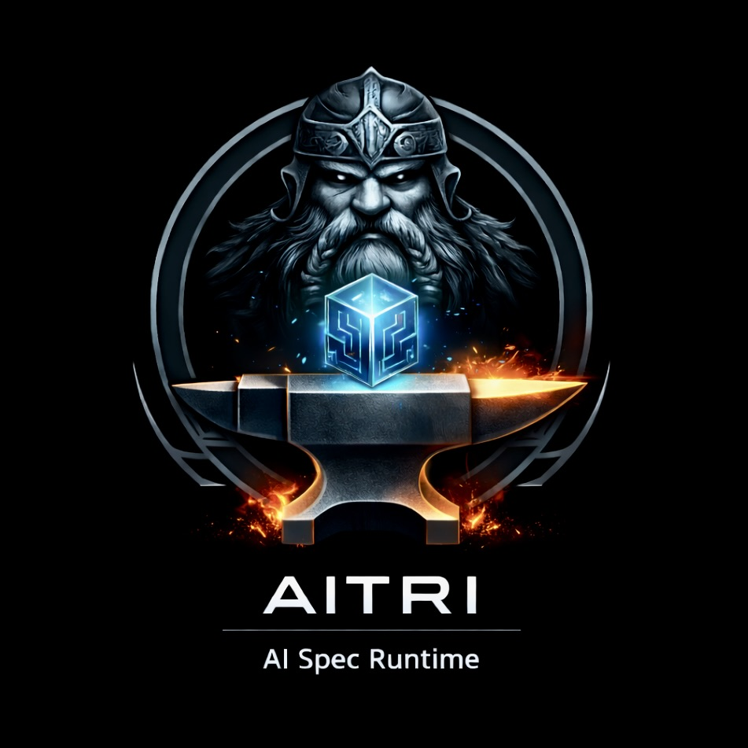

<p align="center">
  
</p>

<h1 align="center">Aitri</h1>

<p align="center">
  <strong>A spec-enforcement skill for AI agents.</strong><br/>
  No artifact ships without a human-approved specification.
</p>

---

## What Aitri Is

Aitri is a **skill consumed by AI agents** (Claude Code, Codex, OpenCode) as their system of record for software delivery.

It enforces one rule: no backlog item, test case, or implementation brief can exist without a human-approved specification that precedes it.

The agent does the work. Aitri verifies the contract was followed.

**What Aitri does:**
- Validates that agent-generated content traces back to approved spec sections (`FR-*`, `AC-*`)
- Blocks writes when traceability is missing
- Generates structured artifacts (test stubs, implementation briefs) from approved specs
- Tracks delivery gates: `spec → backlog → tests → scaffold → verify → deliver`
- Maintains session continuity across agent sessions via checkpoint/resume
- Maps existing projects into the spec-driven model via `aitri adopt`

**What Aitri does not do:**
- Execute code or run tests directly
- Generate requirements — requirements must come from the user
- Replace human judgment at approval gates

---

## Table of Contents

1. [Prerequisites](#1-prerequisites)
2. [Install Aitri Globally](#2-install-aitri-globally)
3. [Install Aitri as an Agent Skill](#3-install-aitri-as-an-agent-skill)
   - [Claude Code](#31-claude-code)
   - [Codex CLI](#32-codex-cli)
   - [OpenCode](#33-opencode)
   - [Gemini CLI](#34-gemini-cli)
4. [Initialize a Project](#4-initialize-a-project)
5. [Workflow: Human (Interactive)](#5-workflow-human-interactive)
6. [Workflow: Agent (Auditor Mode)](#6-workflow-agent-auditor-mode)
7. [Workflow: Brownfield Projects](#7-workflow-brownfield-projects)
8. [Command Reference](#8-command-reference)
9. [Configuration](#9-configuration)
10. [Session Continuity](#10-session-continuity)
11. [Troubleshooting](#11-troubleshooting)
12. [Contributor Validation](#12-contributor-validation)

---

## 1. Prerequisites

- **Node.js** `>=18` and `npm`
- **Git** (required for checkpoint and resume)
- One or more agent CLIs: [Claude Code](https://docs.claude.com/en/docs/claude-code/getting-started), [Codex CLI](https://github.com/openai/codex), [OpenCode](https://opencode.ai/docs/cli/), [Gemini CLI](https://github.com/google-gemini/gemini-cli)

---

## 2. Install Aitri Globally

Clone and install once. Aitri runs as a global CLI available in any project directory.

```bash
git clone https://github.com/cesareyeserrano/aitri.git
cd aitri
npm i -g .
hash -r
```

Verify:
```bash
aitri --version
aitri help
```

**To update Aitri after pulling new changes:**
```bash
cd /path/to/aitri
git pull origin main
npm i -g .
hash -r
aitri --version
```

---

## 3. Install Aitri as an Agent Skill

Each agent platform loads a `SKILL.md` that instructs the agent how to use Aitri. Install the adapter once; the agent reads it automatically on every session.

### 3.1 Claude Code

**Personal install** (applies to all your projects):
```bash
mkdir -p ~/.claude/skills/aitri
cp /path/to/aitri/adapters/claude/SKILL.md ~/.claude/skills/aitri/SKILL.md
```

**Project install** (applies only to one repo, committed to version control):
```bash
mkdir -p .claude/skills/aitri
cp /path/to/aitri/adapters/claude/SKILL.md .claude/skills/aitri/SKILL.md
```

After install, start Claude Code in your target project and request:
```
Use the aitri skill and run: aitri resume
```

### 3.2 Codex CLI

**Personal install:**
```bash
mkdir -p ~/.codex/skills/aitri
cp /path/to/aitri/adapters/codex/SKILL.md ~/.codex/skills/aitri/SKILL.md
```

Restart Codex after installing. Then in any project prompt:
```
Use the aitri skill and run: aitri resume json
```

### 3.3 OpenCode

**Personal install:**
```bash
mkdir -p ~/.config/opencode/skills/aitri
cp /path/to/aitri/adapters/opencode/SKILL.md ~/.config/opencode/skills/aitri/SKILL.md
```

**Project install:**
```bash
mkdir -p .opencode/skills/aitri
cp /path/to/aitri/adapters/opencode/SKILL.md .opencode/skills/aitri/SKILL.md
```

Restart OpenCode and request Aitri workflow execution in your target project.

### 3.4 Gemini CLI

Aitri's Gemini adapter is optimized for Gemini's 1M token context window, enabling deep cross-feature traceability and full-project artifact analysis in a single session.

**Personal install:**
```bash
mkdir -p ~/.gemini/skills/aitri
cp /path/to/aitri/adapters/gemini/SKILL.md ~/.gemini/skills/aitri/SKILL.md
```

**Project install:**
```bash
mkdir -p .gemini/skills/aitri
cp /path/to/aitri/adapters/gemini/SKILL.md .gemini/skills/aitri/SKILL.md
```

Restart Gemini CLI after installing, then in any project:
```
Use the aitri skill and run: aitri resume
```

> **All adapters require** Aitri to be installed globally (`npm i -g .`) before the skill can execute commands.

---

## 4. Initialize a Project

Navigate to any project directory (new or existing):
```bash
cd ~/Documents/PROJECTS/my-project
aitri init
aitri resume
```

`aitri resume` reports the current state and the recommended next command. In a new project it will recommend `aitri draft`.

---

## 5. Workflow: Human (Interactive)

The default interactive workflow. Each command prompts for confirmation before writing.

### Pre-Go (Governance)

```bash
# Create a draft spec from your idea
aitri draft --feature user-auth --idea "Email and password login with forgot-password flow"

# Optional: AI-powered spec quality review
aitri spec-improve --feature user-auth

# Lock the spec — no implementation artifact can exist without this
aitri approve --feature user-auth

# Structured discovery interview artifact
aitri discover --feature user-auth

# Generate plan, backlog, and test cases from the spec
aitri plan --feature user-auth

# Validate traceability (spec → backlog → tests)
aitri validate --feature user-auth

# Runtime verification gate
aitri verify --feature user-auth

# Human GO/NO-GO decision
aitri handoff
aitri go --feature user-auth
```

### Post-Go (Factory)

```bash
# Generate executable test stubs with contract imports
aitri scaffold --feature user-auth --yes

# Generate ordered implementation briefs for each user story
aitri implement --feature user-auth

# Verify after each story implementation
aitri verify --feature user-auth

# Final delivery gate
aitri deliver --feature user-auth
```

---

## 6. Workflow: Agent (Auditor Mode)

The preferred flow when an AI agent is driving execution. The agent authors the backlog and tests; Aitri audits traceability before writing anything.

### Session Start (Every Session)
```bash
aitri checkpoint show     # read saved state
aitri resume json         # get recommendedCommand
```

### Pre-Go

```bash
# Spec phase (human approves)
aitri draft --feature user-auth --idea "Email and password login"
aitri spec-improve --feature user-auth
aitri approve --feature user-auth
aitri discover --feature user-auth

# Agent generates agent-backlog.md + agent-tests.md outside of Aitri
# Format: docs/guides/AGENT_INTEGRATION_GUIDE.md

# Preview the delta before committing
aitri diff --feature user-auth --proposed agent-backlog.md

# Aitri audits traceability — writes only if all traces are valid
aitri plan --feature user-auth --ai-backlog agent-backlog.md --ai-tests agent-tests.md

# Semantic intent validation: do User Stories satisfy FR intent?
aitri verify-intent --feature user-auth

# Continue standard flow
aitri validate --feature user-auth
aitri verify --feature user-auth
aitri go --feature user-auth --yes
```

### Post-Go

```bash
aitri scaffold --feature user-auth --yes
aitri implement --feature user-auth
# agent implements each US-* brief in order (IMPLEMENTATION_ORDER.md)
aitri verify --feature user-auth    # after each story
aitri deliver --feature user-auth
```

### Session End
```bash
aitri checkpoint "what was done — next: what to do next"
```

---

## 7. Workflow: Brownfield Projects

For projects that already exist. `aitri adopt` scans the stack and maps it into the spec-driven model.

```bash
# Phase 1: scan stack, detect conventions, entry points, gaps
aitri adopt

# Phase 2: LLM infers DRAFT specs and discovery docs from existing code
aitri adopt --depth standard

# Phase 3: map existing tests to TC-* stubs
aitri adopt --depth deep

# Dry run (no writes)
aitri adopt --dry-run
```

Requires AI config for `--depth standard` and `--depth deep` (see [Configuration](#9-configuration)).

Output: `docs/adoption-manifest.json`, `specs/drafts/<feature>.md`, `docs/discovery/<feature>.md`, `tests/<feature>/tests.md`.

---

## 8. Command Reference

### Pre-Go (Governance)

| Command | Purpose |
|---------|---------|
| `aitri init` | Initialize project structure |
| `aitri draft` | Create draft spec from idea |
| `aitri spec-improve` | AI-powered spec quality review |
| `aitri approve` | Validate and lock spec |
| `aitri discover` | Structured discovery interview artifact |
| `aitri plan` | Generate plan, backlog, and tests from spec |
| `aitri diff` | Compare current backlog against proposed update |
| `aitri verify-intent` | Semantic validation: User Stories satisfy FR intent |
| `aitri validate` | Traceability gate (spec → backlog → tests) |
| `aitri verify` | Runtime test execution gate |
| `aitri policy` | Managed policy checks before handoff |
| `aitri handoff` | Present handoff status for human GO/NO-GO |
| `aitri go` | Unlock implementation mode |

### Post-Go (Factory)

| Command | Purpose |
|---------|---------|
| `aitri scaffold` | Generate executable test stubs + contract interfaces |
| `aitri implement` | Ordered implementation briefs for each user story |
| `aitri deliver` | Final delivery gate: all FRs covered, all TCs passing |

### Session and State

| Command | Purpose |
|---------|---------|
| `aitri resume` | Recommend next action from saved state |
| `aitri checkpoint [message]` | Save session state |
| `aitri checkpoint show` | Read saved state |
| `aitri status` | Show current project state |

### Brownfield

| Command | Purpose |
|---------|---------|
| `aitri adopt` | Phase 1: scan stack and conventions |
| `aitri adopt --depth standard` | Phase 2: LLM infers draft specs |
| `aitri adopt --depth deep` | Phase 3: map existing tests to TC-* stubs |
| `aitri upgrade` | Apply version-aware migrations |

### Common Flags

| Flag | Use |
|------|-----|
| `--feature <name>` | Target a specific feature (required in multi-feature repos) |
| `--json` / `--format json` | Machine-readable output |
| `--non-interactive` | Suppress prompts (CI/automation only) |
| `--yes` | Auto-confirm write operations (CI/automation only) |
| `--guided` | Enable interactive guided mode (draft, discover) |
| `--dry-run` | Preview without writing |
| `--verify-cmd "<cmd>"` | Override test command for verify |

---

## 9. Configuration

### AI-Powered Commands

`spec-improve`, `verify-intent`, and `adopt --depth standard/deep` require an LLM. Add to `aitri.config.json` at project root:

```json
{
  "ai": {
    "provider": "claude",
    "model": "claude-opus-4-6",
    "apiKeyEnv": "ANTHROPIC_API_KEY"
  }
}
```

Set the environment variable:
```bash
export ANTHROPIC_API_KEY=sk-ant-...
```

### Custom Paths (Brownfield)

If your project uses non-standard folder names:
```json
{
  "paths": {
    "specs": "workspace/specs",
    "backlog": "workspace/backlog",
    "tests": "quality/tests",
    "docs": "knowledge/docs"
  }
}
```

### Policy Rules

```json
{
  "policy": {
    "allowDependencyChanges": false,
    "blockedImports": ["left-pad"],
    "blockedPaths": ["infra/**", "scripts/deploy/**"]
  }
}
```

---

## 10. Session Continuity

Aitri maintains state in `.aitri/DEV_STATE.md` so sessions can be resumed by any agent.

**Auto-checkpoint:** Write commands (`init`, `draft`, `approve`, `discover`, `plan`) create automatic git checkpoints when run inside a git repository. Aitri keeps the latest 10 checkpoint tags.

**Manual checkpoint:**
```bash
aitri checkpoint "what was done — next: what to do next"
```

**Resume:**
```bash
aitri checkpoint show     # read saved state
aitri resume json         # get recommendedCommand as JSON
```

**Disable auto-checkpoint for one command:**
```bash
aitri plan --feature user-auth --no-checkpoint
```

---

## 11. Troubleshooting

| Problem | Cause | Fix |
|---------|-------|-----|
| `Skill not detected` | File path or frontmatter wrong | Verify `SKILL.md` exists at the correct path with `name: aitri` in YAML frontmatter. Restart the agent CLI. |
| `Approved spec not found` | Wrong feature name or spec not approved | Run `aitri approve --feature <name>` |
| `AUDIT FAILED — FR-99 not in spec` | Backlog references non-existent FR | Fix the `Trace:` line in agent-backlog.md |
| `verify-intent: fail` | User Story does not satisfy FR intent | Revise the User Story text |
| `Backlog not found` | Plan not run yet | Run `aitri plan --feature <name>` |
| `Skill tries to read docs before init` | Empty project | Run `aitri resume json` → if `nextStep` is `aitri init`, run it |
| `Aitri prompts in automation` | Interactive mode is default | Add `--non-interactive --yes` in CI only |

---

## 12. Contributor Validation

```bash
npm run test:smoke
npm run test:regression
npm run test:all
npm run check:file-growth
npm run check:file-growth:strict
```

---

## Documentation

| Document | Purpose |
|----------|---------|
| [docs/MANIFESTO.md](docs/MANIFESTO.md) | What Aitri is, design choices, honest scope |
| [docs/architecture.md](docs/architecture.md) | Command flow, artifact topology, agent integration contract |
| [docs/guides/GETTING_STARTED.md](docs/guides/GETTING_STARTED.md) | Detailed first-run walkthrough |
| [docs/guides/AGENT_INTEGRATION_GUIDE.md](docs/guides/AGENT_INTEGRATION_GUIDE.md) | Full agent workflow reference and Auditor Mode spec |
| [docs/guides/SKILL_PACKAGING_AND_INSTALL.md](docs/guides/SKILL_PACKAGING_AND_INSTALL.md) | How to package Aitri as an agent skill |
| [docs/DOC_POLICY.md](docs/DOC_POLICY.md) | Documentation rules and file budget |

---

## License

Apache-2.0 — see [LICENSE](LICENSE) and [NOTICE](NOTICE).
